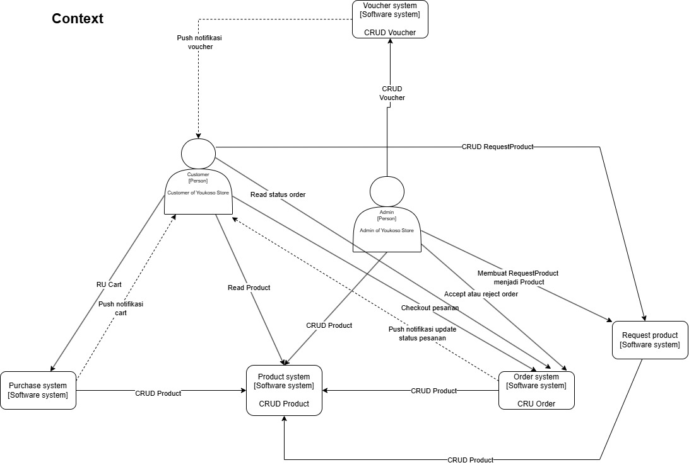
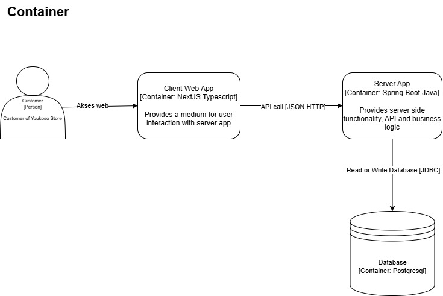
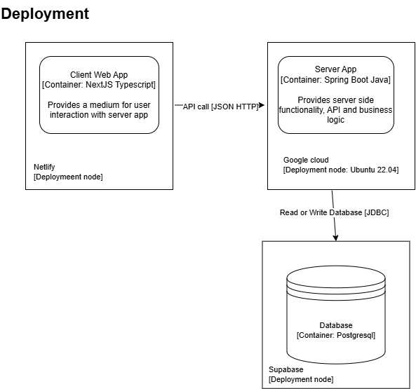
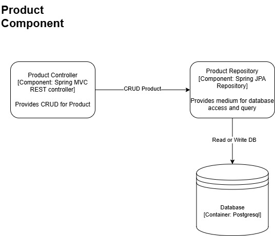
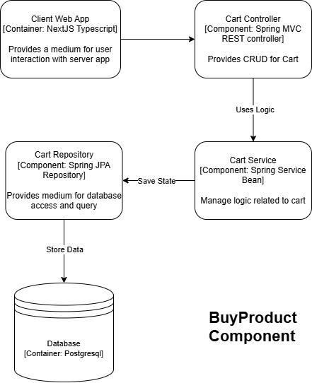
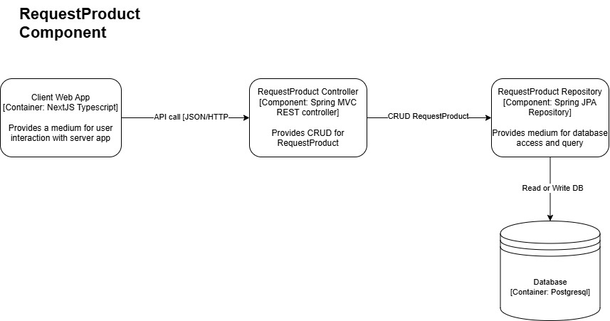
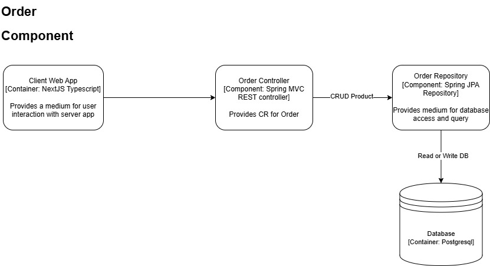

# Kelompok A3

## 1. Current Architecture

### Risiko Arsitektur

- Identifikasi:
  Dengan arsitektur yang sekarang, proyek kita database-nya tidak fault tolerant karena tidak menerapkan replikasi pada beberapa data center region yang berbeda, serta untuk setiap microservice hanya memiliki satu node, dan jika node tersebut down, maka aplikasi menjadi tidak berfungsi. Scalabilitynya juga kurang karena kita tidak setup untuk horizontal scaling dan load balancing, sehingga jika terjadi lonjakan pengguna yang sangat besar, maka server akan sangat kewalahan. Server juga tidak di-setup untuk mengakomodir pengguna dari berbagai region, sehingga, jika ada pengguna dari region yang jauh dari server akan berdampak pada latency yang akan menjadi tinggi.

- Konsensus:
  Semua setuju.

- Mitigasi:
  Kita akan menerapkan CDN untuk website, dan replikasi untuk database dan server sehingga availability menjadi lebih baik dan latency berkurang untuk pengguna dari berbagai region. Mungkin kita akan migrasi ke database noSQL untuk menerapkan sharding untuk meningkatkan performa database. Kita juga akan men-setup horizontal scaling dan load balancing, agar ketika terjadi lonjakan pengguna, server masih dapat mengakomodir pengguna tersebut.

## 2. Future Architecture

### Context

### Container

### Deployment

## Why risk storming is applied?

Tujuan dari risk storming adalah mengidentifikasi, mengevaluasi, dan mengembangkan rencana mitigasi dan kontingensi untuk risiko yang ada dan berpotensi ada. Dengan demikian, proses pengembangan menjadi lebih lancar dan tingkat keberhasilan lebih tinggi.

## Individual Component Diagram

### Product (Ahmad Fatih Faizi)

### Buy Product (Abbilhaidar Farras Zulfikar)

### Request Product (Mariano Gerardus Senduk)

### Order (Muhamad Rifqi)

